<div align="center">


<a href="https://github.com/emmanuelmwangi88-ui">
  
</a>


<a href="mailto:emmanuelmwangi88@gmail.com">
  
</a>

</div>

<div align="center">

</div>

## ⛓️ About Me

```python
class Denji(Developer):
    def __init__(self):
        self.real_name   = "Emmanuel Mwangi"
        self.alias       = "Denji"
        self.role        = "Android / Kotlin Developer & Frontend Builder"
        self.stack       = ["Kotlin", "Python", "JavaScript", "HTML", "CSS", "Bootstrap"]
        self.weapon      = "Android Studio ⚙️"
        self.status      = "Hunting bugs, signing contracts with clean code"
        self.location    = "Kenya 🇰🇪"
        self.email       = "emmanuelmwangi88@gmail.com"

    def goals(self):
        return "Ship projects worth showing off, level by level."
```

* 🩸 I write code the way Denji swings a chainsaw — fast, fearless, and a little chaotic until it works.
* 🛠️ Currently leveling up my **Kotlin / Android** game and sharpening **JavaScript** for the frontend fights.
* 🐍 Building my **Python** fundamentals on the side.
* 📡 Always open to collabs, gigs, and devil-contracts (a.k.a. interesting projects) — reach me at **emmanuelmwangi88@gmail.com**.

## ⚔️ Tech Arsenal

<div align="center">

</div>

## 🎯 Live Language Breakdown

<sub>Pulled straight from my public repos — updates automatically, no manual editing.</sub>

<div align="center">

</div>

## 📈 Coding Activity

<div align="center">

</div>

## 📊 Battle Stats

<table align="center">
  <tr>
    <td></td>
    <td></td>
  </tr>
</table>

## 📋 Recent GitHub Activity

<!--START_SECTION:activity-->
<!--END_SECTION:activity-->

<sub>⚙️ This list fills in automatically with your real latest commits, PRs, issues, and stars — see setup below.</sub>

<details>
<summary>⚙️ One-time setup (click to expand)</summary>

1. Go to **Settings → Developer settings → Personal access tokens → Tokens (classic)** on GitHub and generate a new token with the `repo` scope.
2. In this repo, go to **Settings → Secrets and variables → Actions → New repository secret**. Name it `GH_TOKEN` and paste the token as the value.
3. Add a file at `.github/workflows/activity.yml` with this content:

```yaml
name: Update Recent Activity

on:
  schedule:
    - cron: "*/30 * * * *"   # every 30 minutes
  workflow_dispatch: {}

jobs:
  update-readme:
    runs-on: ubuntu-latest
    steps:
      - uses: actions/checkout@v4
      - uses: jamesgeorge007/github-activity-readme@master
        env:
          GH_TOKEN: ${{ secrets.GH_TOKEN }}
```

4. Commit, push, then run it once from the **Actions** tab. The two comment markers above will fill in with your real recent activity and keep updating every 30 minutes on their own.

</details>

## 🐍 Contribution Snake

<div align="center">

</div>

<sub>⚙️ Auto-regenerated every 12 hours by the `snake.yml` GitHub Action already in this repo.</sub>

## 🏅 GitHub Achievements

<div align="center">

</div>

<details>
<summary>⚙️ One-time setup (click to expand)</summary>

These are your real, official GitHub Achievements (Pull Shark, Quickdraw, etc.) — rendered by a GitHub Action you run yourself, not a third-party site, so it isn't affected by the rate-limit issues elsewhere in this README.

1. Go to **Settings → Developer settings → Personal access tokens → Tokens (classic)** and generate a token with `repo` and `read:user` scopes.
2. In this repo, go to **Settings → Secrets and variables → Actions → New repository secret**. Name it `METRICS_TOKEN`, paste the token as the value.
3. Add a file at `.github/workflows/metrics.yml`:

```yaml
name: Metrics
on:
  schedule:
    - cron: "0 0 * * *"   # once a day
  workflow_dispatch: {}

jobs:
  github-metrics:
    runs-on: ubuntu-latest
    permissions:
      contents: write
    steps:
      - uses: actions/checkout@v4
      - uses: lowlighter/metrics@latest
        with:
          filename: metrics.svg
          token: ${{ secrets.METRICS_TOKEN }}
          base: ""
          plugin_achievements: yes
          plugin_achievements_threshold: C
          plugin_achievements_secrets: yes
          plugin_achievements_display: detailed
```

4. Commit, push, then run it once from the **Actions** tab. It'll commit `metrics.svg` to your repo root, and the image above will populate — refreshing once a day on its own after that.

</details>

## 🏆 Trophy Case

<!-- Currently using an independent trophy fork (not the same congested pool as the official ryo-ma mirrors). Once your own Vercel deploy is ready, replace ONLY the domain below with your own. -->
<div align="center">

</div>

<details>
<summary>⚙️ Status + fallback options (click to expand)</summary>

The official trophy server (`github-profile-trophy.vercel.app`) is hitting GitHub API rate limits shared across everyone using it — that's why it (and many mirrors) intermittently break. This README uses a community mirror as a stopgap.

**Permanent fix:** deploy your own private copy (steps already covered separately) — once you have your own `.vercel.app` domain, send it over and only the domain in the line above needs to change.

Other mirrors to try in the meantime if this one drops:
- `https://github-profile-trophy-liard-delta.vercel.app`
- `https://github-profile-trophy-fork-two.vercel.app`
- `https://github-profile-trophy-kannan.vercel.app`

</details>

## 🗂️ Featured Projects

<sub>Every card below pulls its stars, forks, and language live from GitHub — nothing here is typed in manually, so it stays accurate as your repos change.</sub>

<table align="center">
  <tr>
    <td><a href="https://github.com/emmanuelmwangi88-ui/kotlinbasics"></a></td>
    <td><a href="https://github.com/emmanuelmwangi88-ui/first-app"></a></td>
  </tr>
  <tr>
    <td><a href="https://github.com/emmanuelmwangi88-ui/Personal-portfolio"></a></td>
    <td><a href="https://github.com/emmanuelmwangi88-ui/PrimeHaven"></a></td>
  </tr>
  <tr>
    <td><a href="https://github.com/emmanuelmwangi88-ui/AxisPro"></a></td>
    <td><a href="https://github.com/emmanuelmwangi88-ui/Python-Basics"></a></td>
  </tr>
  <tr>
    <td><a href="https://github.com/emmanuelmwangi88-ui/Birthday-card"></a></td>
    <td></td>
  </tr>
</table>

<div align="center"><sub>🔗 AxisPro doesn't have a live demo yet — once GitHub Pages is turned on for it, a live link gets added here.</sub></div>

## 🛣️ Currently Learning / Up Next

<div align="center">

`Kotlin & Android Studio` → going deeper into real app builds
`JavaScript` → sharpening fundamentals for frontend work
`Python` → building on the basics toward practical projects

</div>

## 💬 Quote of the Visit

<div align="center">

</div>

<div align="center">

</div>

## 📡 Open Contracts (Let's Connect)

<div align="center">

<a href="mailto:emmanuelmwangi88@gmail.com" target="_blank">
  
</a>
<a href="https://github.com/emmanuelmwangi88-ui" target="_blank">
  
</a>
<a href="https://www.instagram.com/itadori_manu/" target="_blank">
  
</a>

</div>


<div align="center">
<sub>⚡ "I don't fear bugs. Bugs fear me." — Denji, probably ⚡</sub>
</div>